# 🌐 Responsive Dashboard Project

A **fully responsive dashboard** built with **HTML & CSS**, designed to provide a seamless user experience across **desktop, tablet, and mobile devices**.  
The dashboard includes **8 pages** with a sliding navigation bar, making it easy to navigate between sections and manage content dynamically.

---

## 🔗 Live Demo

[View Live Demo](https://youssefadel170.github.io/Dashboard-template/)

---

## 🗂 Pages Overview

### 1️⃣ Dashboard

Provides an overview of the system:

- Welcome
- Quick Draft
- Yearly Targets
- Tickets Statistics
- Latest News & Tasks
- Top Search Items & Uploads
- Last Project Progress & Reminders
- Social Media Stats & Projects

### 2️⃣ Settings

Manage your application settings:

- Site Control
- General Info
- Security Info
- Social Info
- Widgets Info
- Backup Manager

### 3️⃣ Profile

Displays user profile and activity:

- Profile Section
- Skills & Activities

### 4️⃣ Projects

Shows 9 different project details.

### 5️⃣ Courses

Displays 7 course sections.

### 6️⃣ Friends

Friends list with:

- Name & Title
- Number of Friends
- Projects & Articles
- Joined Date

### 7️⃣ Files

Organize and view various file types.

### 8️⃣ Plans

Pricing options:

- Free Plan
- Basic Plan
- Premium Plan

---

## ✨ Key Features

- **Responsive Design**: Works flawlessly on desktops, tablets, and mobile devices
- **Sliding Navigation Bar**: Smooth transitions between pages
- **Customizable Sections**: Easily manage content for projects, courses, friends, etc.
- **User-Friendly Interface**: Clean, modern, and intuitive design

---

## 🛠 Technologies Used

- **HTML5**: Page structure
- **CSS3**: Styling & responsive layouts
  - Flexbox & Grid for flexible layouts
  - Media Queries for cross-device compatibility

---

## 🖼 Screenshots

### 💻 Desktop Views

- **Dashboard Pages:**  
  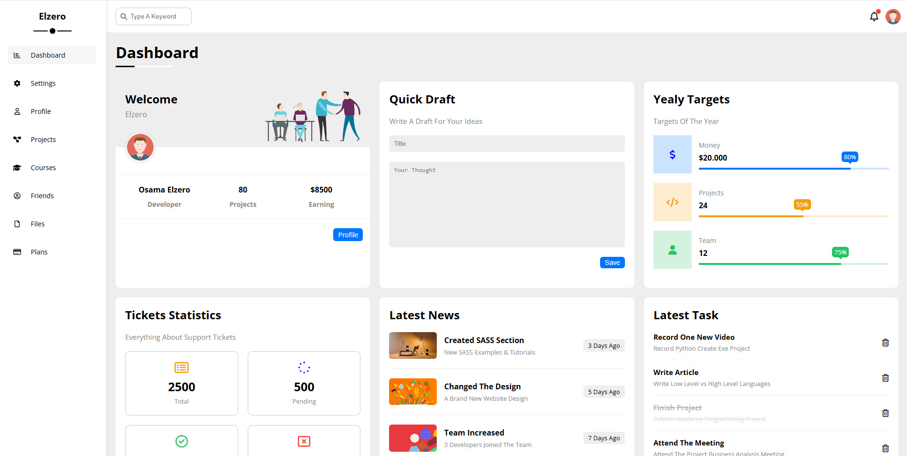  
  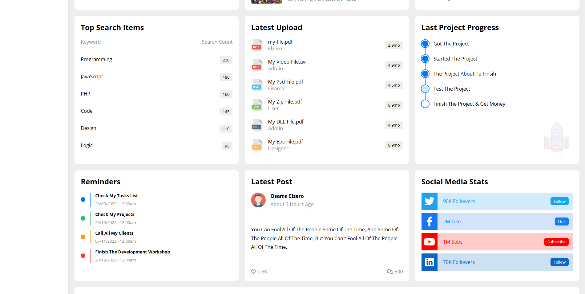  
  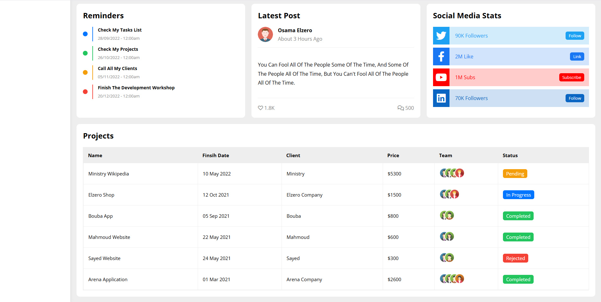

- **Settings Page:**  
  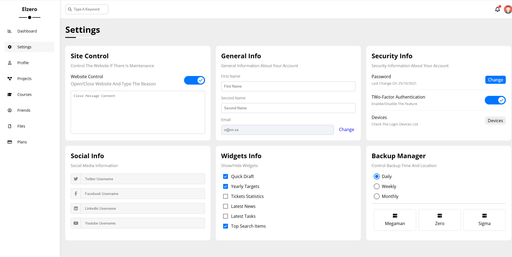

- **Profile Page:**  
  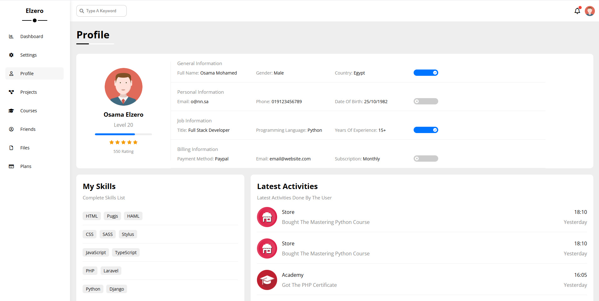

- **Projects Page:**  
  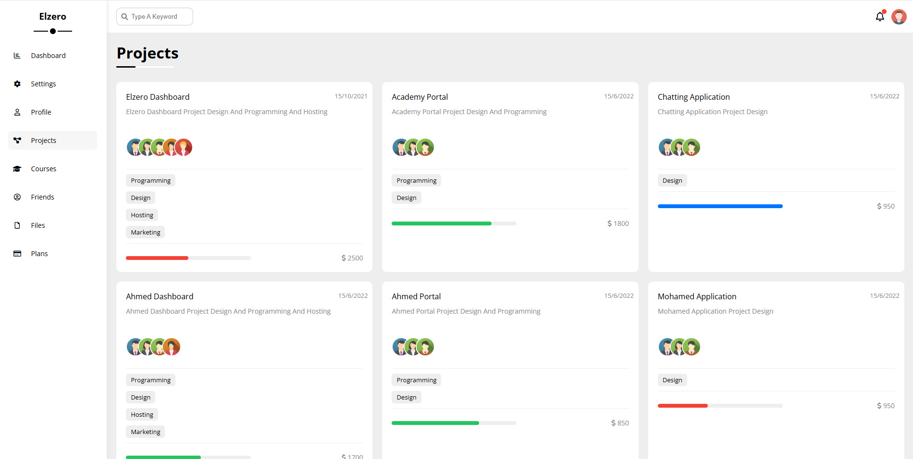

- **Courses Page:**  
  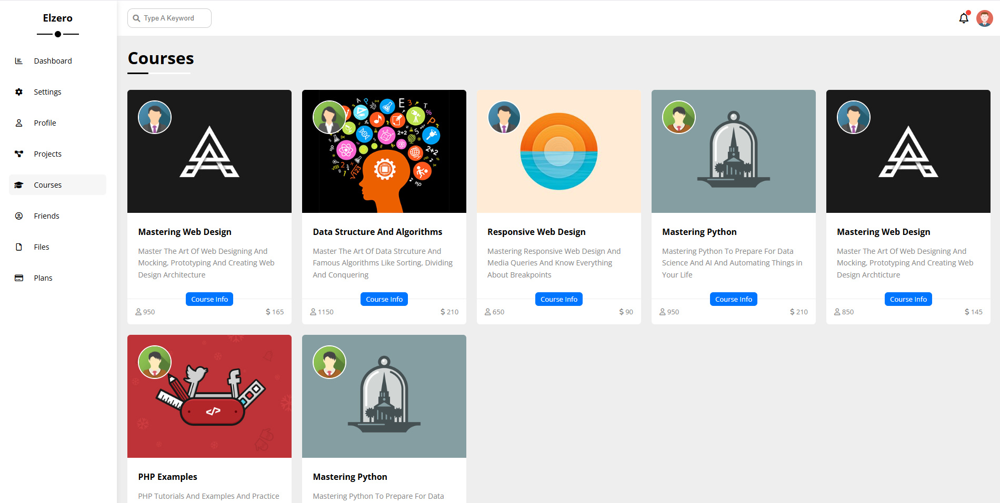

- **Friends Page:**  
  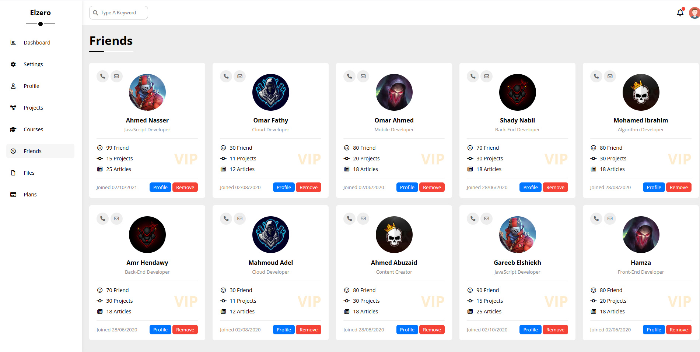

- **Files Page:**  
  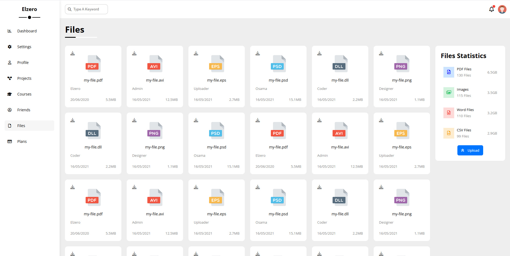

- **Plans Page:**  
  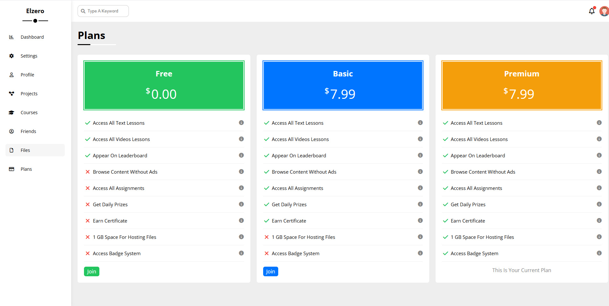

### 📱 Mobile View

- **Dashboard on Mobile:**  
  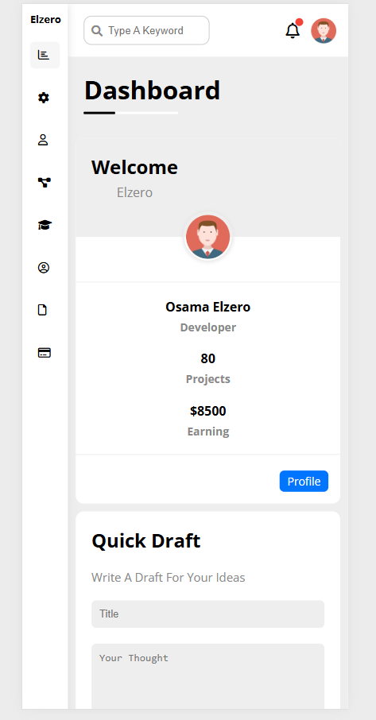

---

## 🚀 Installation

1. **Clone the repository**

```bash
git clone https://github.com/YoussefAdel170/Dashboard-template.git
```

2. **Navigate into the project directory**
   ```bash
   cd Dashboard-template
   ```
3. Open **index.html** in your browser.
